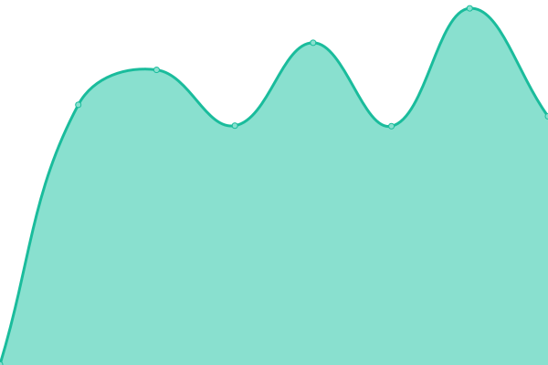
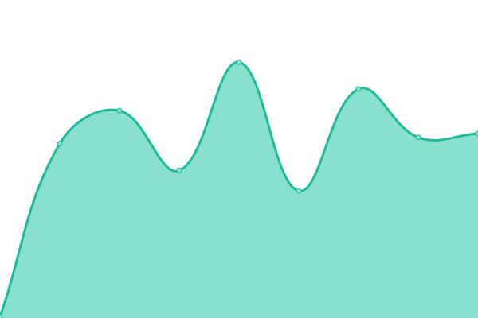

# [📈 Live Status](https://status.powbot.org): <!--live status--> **🟧 Partial outage**

This repository contains the open-source uptime monitor and status page for [PowBot](https://powbot.org), powered by [Upptime](https://github.com/upptime/upptime).

With [Upptime](https://upptime.js.org), you can get your own unlimited and free uptime monitor and status page, powered entirely by a GitHub repository. We use [Issues](https://github.com/powbot/status/issues) as incident reports, [Actions](https://github.com/powbot/status/actions) as uptime monitors, and [Pages](https://status.powbot.org) for the status page.

<!--start: status pages-->
<!-- This summary is generated by Upptime (https://github.com/upptime/upptime) -->
<!-- Do not edit this manually, your changes will be overwritten -->
<!-- prettier-ignore -->
| URL | Status | History | Response Time | Uptime |
| --- | ------ | ------- | ------------- | ------ |
|  [PowBot Site](https://www.powbot.org) | 🟩 Up | [pow-bot-site.yml](https://github.com/powbot/status/commits/HEAD/history/pow-bot-site.yml) | 

 1163ms
     
 | 

<a href="https://status.powbot.org/history/pow-bot-site">100.00%</a>
    

|  [PowBot SDN](https://api.powbot.org/products) | 🟥 Down | [pow-bot-sdn.yml](https://github.com/powbot/status/commits/HEAD/history/pow-bot-sdn.yml) | 

 913ms
     
 | 

<a href="https://status.powbot.org/history/pow-bot-sdn">100.00%</a>
    

|  [Webwalker](https://walker.dax.cloud) | 🟩 Up | [webwalker.yml](https://github.com/powbot/status/commits/HEAD/history/webwalker.yml) | 

 120ms
     
 | 

<a href="https://status.powbot.org/history/webwalker">100.00%</a>
    

<!--end: status pages-->

[**Visit our status website →**](https://status.powbot.org)

## 📄 License

- Powered by: [Upptime](https://github.com/upptime/upptime)
- Code: [MIT](./LICENSE) © [PowBot](https://powbot.org)
- Data in the `./history` directory: [Open Database License](https://opendatacommons.org/licenses/odbl/1-0/)
